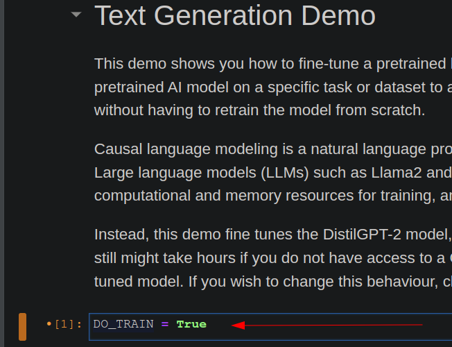
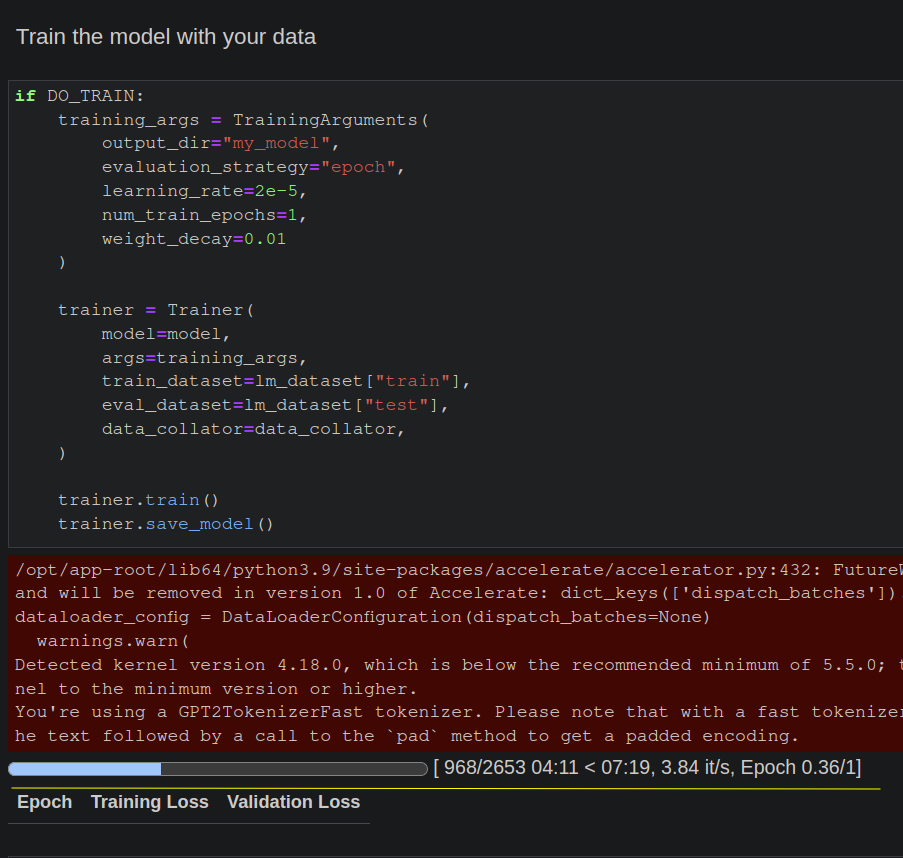

# Testing The GPU

There is an example dataset and notebook available in the [Red Hat QuickCourses](https://github.com/RedHatQuickCourses/rhods-intro/tree/main/notebooks/intro-text-generation)

Assuming that you have a workbench already created, launch your notebook and then clone the GIT repository:

The imported repository will show up as `rhods-intro`. 

The notebook is nested is located in the `notebooks/intro-text-generation` directory. Select `notebook.ipynb`:

> [!IMPORTANT]
> The Notebook is a complete example and needs only a small tweak for the purposes of this demo. Ensure that you set `DO_TRAIN = True`. By default it is set to false which will cause the Notebook to download a copy of the pre-trained model. As we want to prove that the GPU is being utilized for the training, we want to ensure that `DO_TRAIN = True`.

Proceed through running the notebook. The initial `pip install` take a minute or two to complete. Eventually you will see a section of code with the header **Train the model with your data**. This section can take 10 minutes or longer depending on the GPU available.

> [!NOTE]
> Red text boxes which usually indicate errors in the notebook are expected. Most of them are expected, however, you should still read them in the event that a python module was not installed correctly.

## Validate GPU Usage

If you have enabled the NVIDIA DCGM Dashboard in the OpenShift UI, navigate to **Observe --> Dashboards** and then select `NVIDIA DCGM Exporter Dashboard`:

The GPU utilization graph can be found by scrolling down. It may take a few minutes of processing before there is any activity on the graphs. Eventually you should see heavy GPU utilization.

