- [Installing The Operators](#installing-the-operators)
  - [Installing The OpenShift Pipeline Operator](#installing-the-openshift-pipeline-operator)
  - [Installing The OpenShift AI Operator](#installing-the-openshift-ai-operator)
  - [Installing The NVIDIA GPU Operator](#installing-the-nvidia-gpu-operator)
    - [Node Feature Discovery](#node-feature-discovery)
    - [NVIDIA Operator](#nvidia-operator)
    - [NVIDIA Cluster Monitoring](#nvidia-cluster-monitoring)
  - [NVIDIA - Configuring Time Slicing]()
- [Workbench Basics](#workbench-basics)
  - [Setting Up A Workbench](#setting-up-a-workbench)
  - [Rolebindings](#rolebindings)
    - [Workbench RBAC](#workbench-rbac)
  - [Default PVC For Notebookes](#default-pvc-for-notebookes)
    - [Workbench PVC](#workbench-pvc)
  - [Dealing With Idle Notebooks](#dealing-with-idle-notebooks)
    - [Workbench Idle Notebooks](#workbench-idle-notebooks)
  - [Creating A Pipeline Server](#creating-a-pipeline-server)
    - [Pipeline Servers](#pipeline-servers)

# Installing The Operators

OpenShift AI has a single operator for the base installation. However, it is strongly recommended to install the OpenShift Pipelines operator as well to facilitate pipelines in the Data Science workflow. To that end, the below instructions will help walk you through the installation of the operators. In the [artifacts](../../artifacts) directory of this repository, there are example YAMLs that can be used to install the operators.

## Installing The OpenShift Pipeline Operator

In contrast to the OpenShift AI Operator, the Pipeline Operator only requires an appropriate subscription to become active on the cluster.

Navigate to **Operators --> OperatorHub** on the left hand menu in the OpenShift UI and search for OpenShift Pipelines and select the appropriate option:
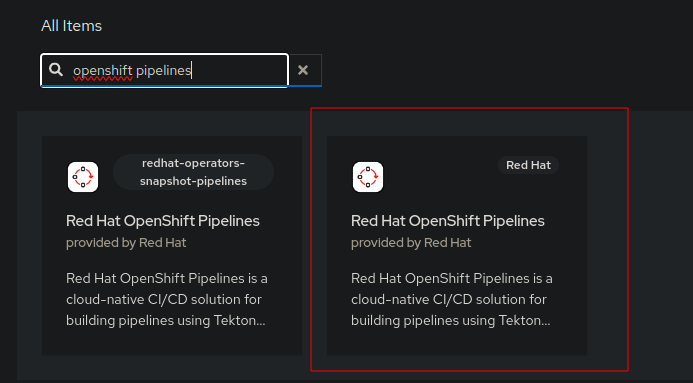

The next screen is informational with no options to select. Click **Install**:

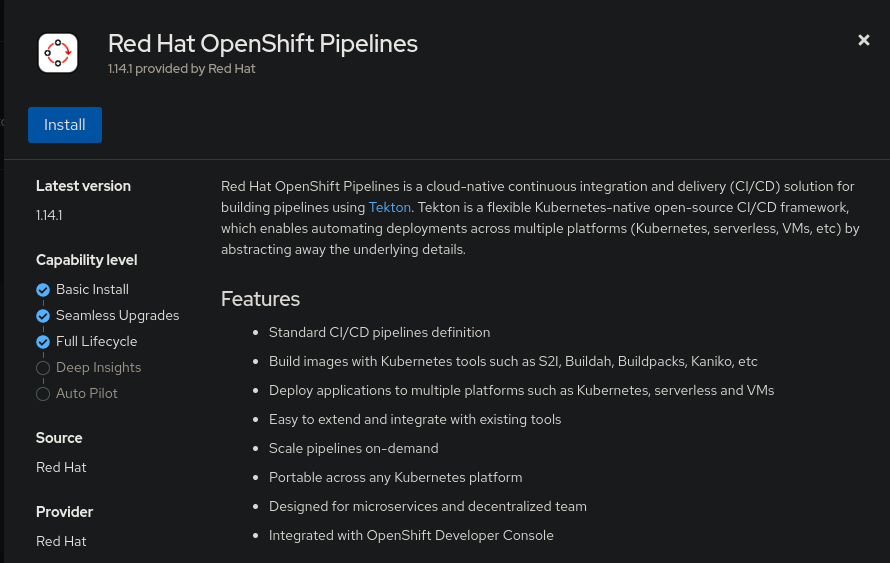

The defaults on the Operator page can be used safely. If you know you need a specific version of the Pipeline Operator, select the appropriate Update Channel and then click install and wait for the operator installation to complete.

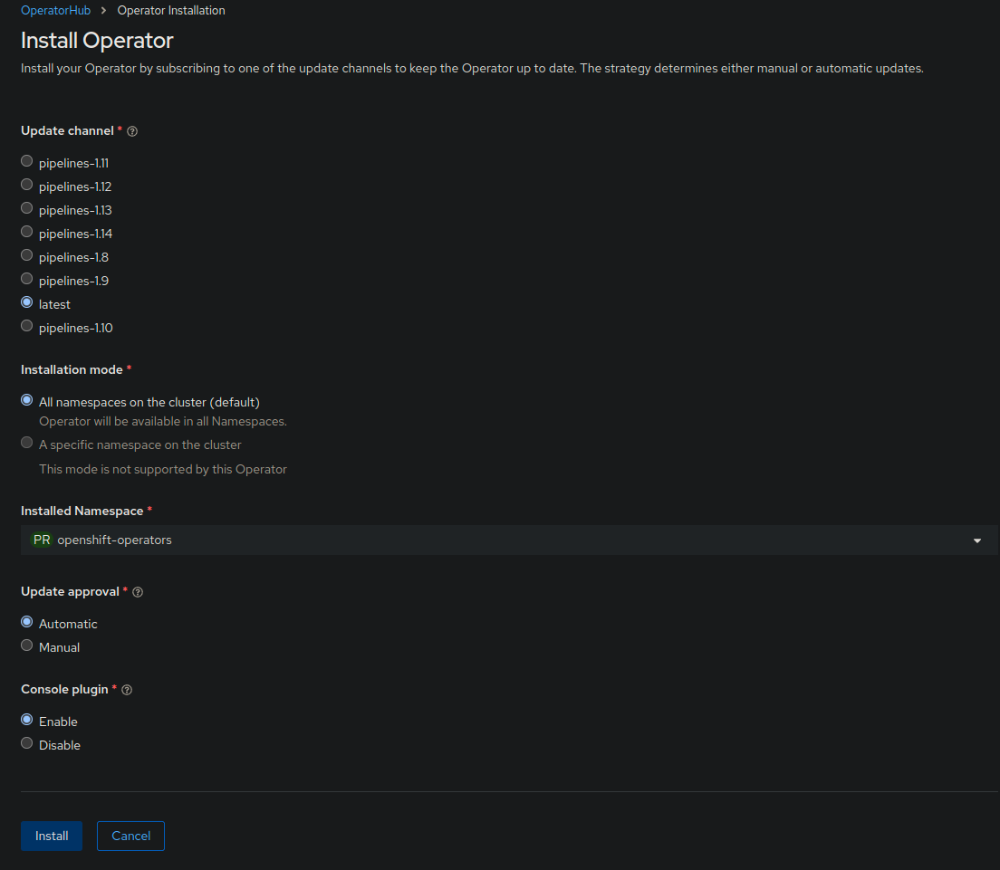

## Installing The OpenShift AI Operator

##blank

## Installing The NVIDIA GPU Operator

### Node Feature Discovery

The Node Feature Discovery (NFD) Operator is a prerequisite for the NVIDIA GPU Operator.

On the left hand menu, navigate to **Operators --> OperatorHub** and then search of the Node Feature Discovery Operator:

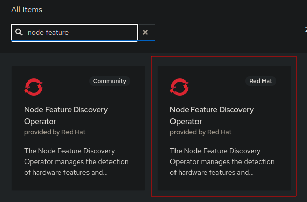

The next screen is purely informational, explaining a bit about the operator itself. There are no options on this page, so after you are done reading you can click the **Install** button:

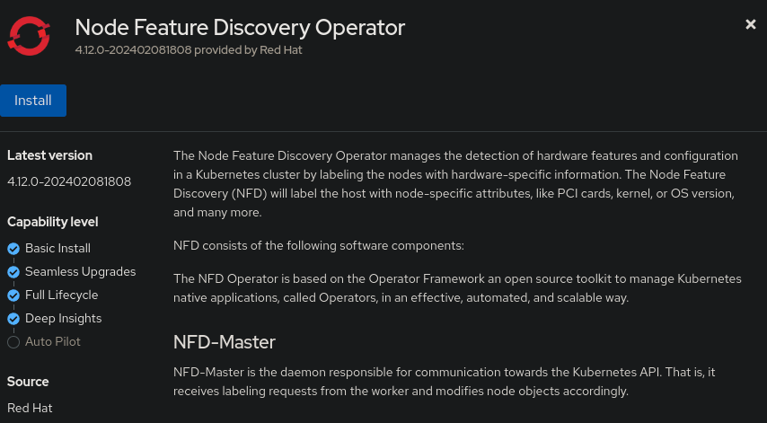

Red Hat *strongly* recommends installing the NFD Operator to `openshift-nfd`. Make sure you select **A Specific Namespace On The Cluster Option**. The option to use `openshift-nfd` should be selected for you if the specific namespace option is selected:


After the operator is installed, you will need to create a NodeFeatureDiscovery. If you are not prompted to create one, select the NFD Operator by clicking on the left hand menu **Operators --> Installed Operators**. Select the `openshift-nfd` project from the drop down and then select Node Feature Discovery Operator. Along the top there will be a tab for NodeFeatureDiscovery. Click **Create NodeFeatureDiscovery**:

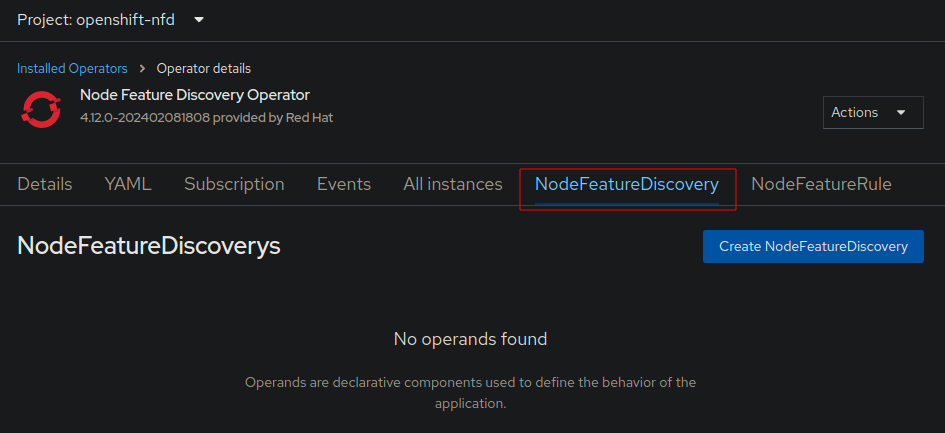

On the creation screen, the default name for the object is `nfd-instance`. This is the preferred name if it is not auto-populated. For most users, the default options are fine. Advanced users can edit the form, or dive right into the YAML.

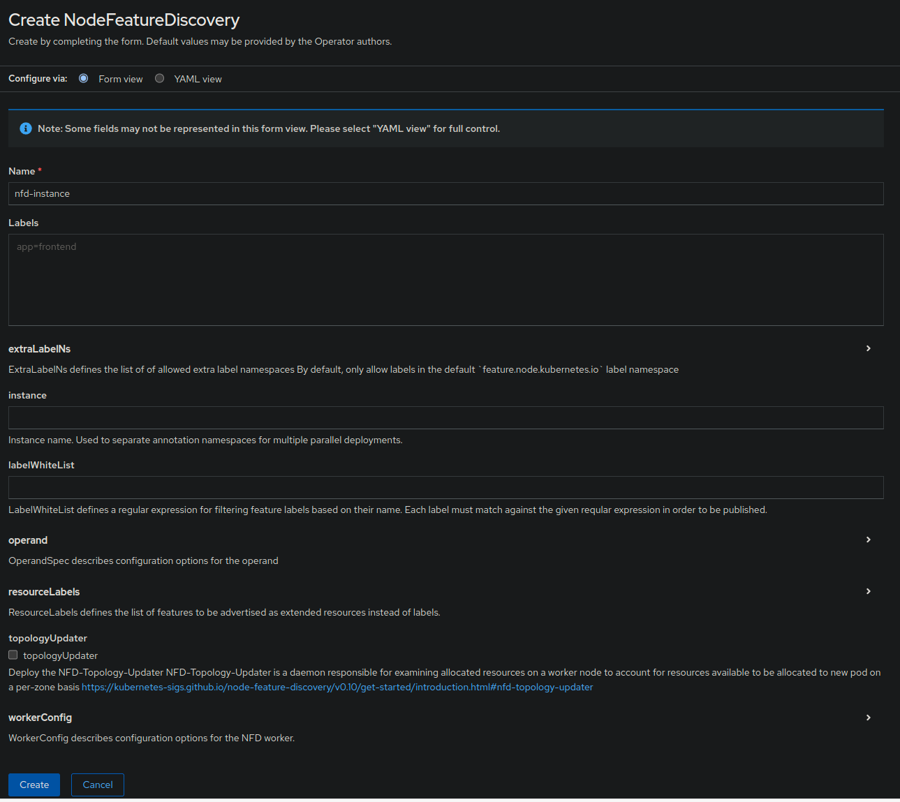

> [!NOTE]
> If you experience problems with your hardware being detected, it is likely a problem with the NFD Operator configuration. There should be no white or black lists by default. However, if this object is modified incorrectly, it can prevent GPUs from being detected.

To validate that the NFD operator is working correctly, navigate to **Compute --> Nodes** and then select a node you know has a GPU in it. With the node selected, go to the details tab.

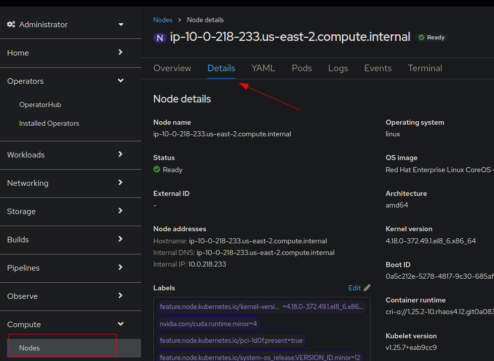

Look for the label `nvidia.com/gpu.present=` in order to find out if the GPU has been detected.

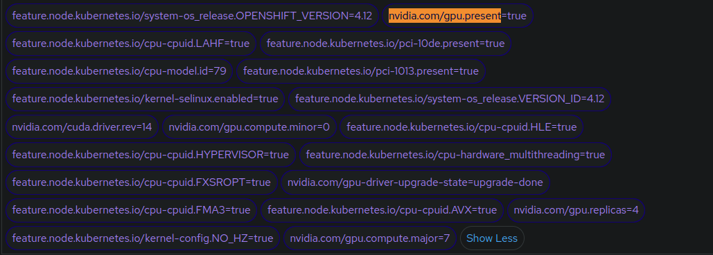

### NVIDIA Operator

After installing the NFD Operator, you can move forward with installing the NVIDIA GPU operator.

On the left hand menu, navigate to **Operators --> OperatorHub** and then search of the NVIDIA GPU Operator:

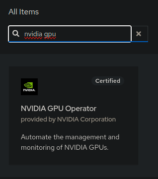

The next screen is purely informational, explaining a bit about the operator itself. There are no options on this page, so after you are done reading you can click the **Install** button:

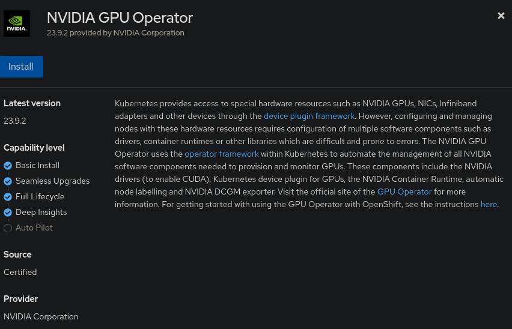

NVIDIA currently recommends having a **Manual** installPlan Approval for the subscriptions. By default the **Automatic** option is selected.

You can pick the update channel based on the needs in your cluster.

Finally, by default, the operator will be installed into the `nvidia-gpu-operator` namespace. If the namespace is not present, it will be created for you during this process:


> [!IMPORTANT]
> While it is possible to use a different namespace, namespace monitoring will *not* be enabled by default. You can enable monitoring with the following:
> `oc label ns/$NAMESPACE_NAME openshift.io/cluster-monitoring=true`

If you have chosen the manual approval process, you will need to approve the installation before continuing:


After the NVIDIA GPU Operator has been successfully installed, you will need to create a ClusterPolicy. This policy includes things like NVIDIA license information (if required), which options are enabled, what repos are used etc.

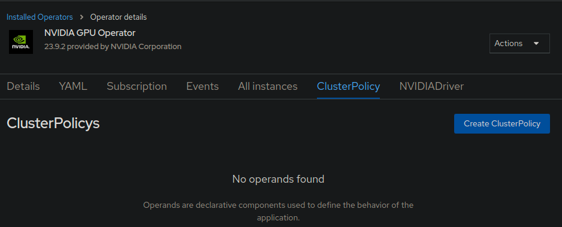

It is safe to take the defaults on the policy screen. [NVIDIA's Documentation](https://docs.nvidia.com/datacenter/cloud-native/openshift/23.9.2/install-gpu-ocp.html#create-the-cluster-policy-using-the-web-console) indicate that the defaults are sufficient for the vast majority of usecases. More advanced users are welcome to explore the options laid out in either the **Form View** or the **YAML View** before creating the policy.


After some time you can navigate to **Workloads --> Pods** on the left hand menu. Ensure that the `nvidia-gpu-operator` project is selected from the drop down. You should see 20 or more pods running in the cluster as seen below:

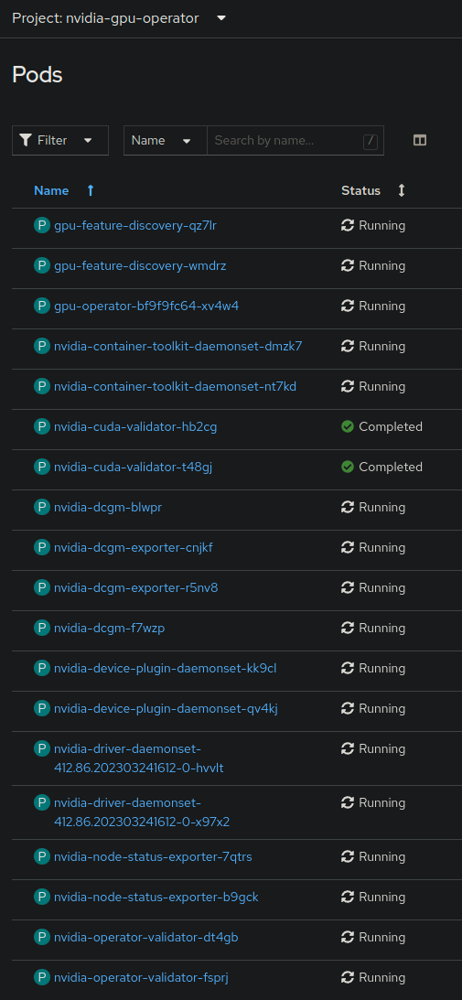

### NVIDIA Cluster Monitoring

The GPU Operator generates GPU performance metrics (DCGM-export), status metrics (node-status-exporter) and node-status alerts. For OpenShift Prometheus to collect these metrics, the namespace hosting the GPU Operator must have the label `openshift.io/cluster-monitoring=true`.

By default, monitoring will be enabled on the `nvidia-gpu-operator` namespace. This is the default namespace that is recommended to install the NVIDIA objects into.

> [!NOTE]
> If you are using a non-default project name you need to run
>
> ```
> oc label ns/$NAMESPACE openshift.io/cluster-monitoring=true
> ```
>
> in order to enable cluster monitoring.

#### Enabling Monitoring Dashboard

To enable the monitoring dashboard in the OpenShift UI, you first need to get the appropriate object definition. The JSON file is too large to be included directly in the body of this text. However, it can be found in the `artifacts/NVIDIA_Operator` directory. This is provided for convenience and NVIDIA may choose to update this file. Always grab the latest version of this file when in doubt:

```
curl -LfO https://github.com/NVIDIA/dcgm-exporter/raw/main/grafana/dcgm-exporter-dashboard.json
```

After downloading the file, you need to create a configmap from the file:

```
oc create configmap nvidia-dcgm-exporter-dashboard -n openshift-config-managed --from-file=dcgm-exporter-dashboard.json
```

> [!IMPORTANT]
> The dashboard is not exposted via ANY view in the OpenShift UI by default. You can choose to enable this view in both the Administrator and Developer OpenShift Views if you so choose.

To enable the dashboard in the Administrator view in the OpenShift Web UI run the following:

```
oc label configmap nvidia-dcgm-exporter-dashboard -n openshift-config-managed "console.openshift.io/dashboard=true"
```

To enable the dashboard for the developer view as well run the following command:

```
oc label configmap nvidia-dcgm-exporter-dashboard -n openshift-config-managed "console.openshift.io/odc-dashboard=true"
```

## 

# Workbench Basics

## Creating A Workbench

In order to organize models, notebook images and other OpenShift AI artifacts you need to create a workbench. Workbenches are created in the context of distinct Data Science Projects.

## Setting Up A Workbench

#### UI - Workbench Setup

From the OpenShift AI Web UI, click `Data Science Projects` on the left hand menu. This will list all of the current projects. You can select a current project or create a new one. Select your project:


If this is a new project, you will be greated with a blank `Components` page:


Click the `Create Workbench` button. The `Name`, `Image Selection` and `Cluster Storage` sections are required.


> [!IMPORTANT]
> You can optionally select `Use a data connection`. If you do, you will be prompted for your Object Storage credentials. This is different from cluster storage. The workbench itself creates a MariaDB container and the cluster storage is mounted into the database container. The `Data Connection` is used for storing pipeline and other objects.

Once the information has been entered click `Create Workbench` and wait for the process to complete.


## Rolebindings

### General Explanation

OpenShift AI relies on most of the underlying mechanisms in OpenShift for controlling access to OpenShift AI. In vanilla OpenShift, you create projects which then have various security methods applied to them in order to ensure that administrators have fine-grained control over who can access which objects and with what permissions. A Data Science Project is just an OpenShift Project that has a specific label which enables it to be used with the OpenShift AI Dashboard.

### Workbench RBAC

##### Using OpenShift AI's Dashboard

OpenShift AI's Dashboard is an object inside of OpenShift. By default the Dashboard will have the option to "Log in with OpenShift"

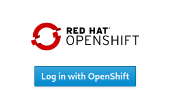

This means if you have an authentication provider configured by an OpenShift Administrator, those users and groups will be available within the OpenShift AI Dashboard. There is a distinction between users who are allowed to login to the OpenShift AI Dashboard and users who have access to various Data Science Projects.

##### UI - Controlling Access To The Dashboard Itself

There are two methods for manipulating group access. First, the OpenShift AI Dashboard (assuming the user you are logged in as has the appropriate permissions) allows administrators to select via a drop down groups:

.

> [!IMPORTANT]
> By default the `system:authenticated` group is selected. This allows anyone who can log into OpenShift to have access to the OpenShift AI Dashboard. This may not be what you want.

When you make a change to the user or group, the Dashboard Config object is edited for you. The operator, which resides in the project `redhat-ods-operator` will reconcile the changes made to this object after a short period of time by merging the changes with the active configuration of the containers.

##### UI - Controlling Data Science Project Access

You may wish to grant users or groups to various roles inside of a Data Science Project as well. In order to do this, select Data Science Projects --> Your Project --> Permissions:


From here you can select the various roles you might have created in your OpenShift Cluster. By default the Edit and Admin options are available.

## Default PVC For Notebookes

### Setting PVCs For Jupyter Notebooks

It is often desirable to adjust the default amount of storage provided to a Jupyter Notebook in order to accommodate the standard workloads your organization may wish to deploy. By default OpenShift AI will allocate 20G with of disk space to every Jupyter Notebook that is created.

### Workbench PVC

##### UI - Storage For Notebooks

In the OpenShift AI UI you can adjust the PVC settings by navigating to Settings --> Cluster Settings --> PVC Size


Update the PVC to the desired size, scroll all the way to the bottom and click Save.

> [!IMPORTANT]
> This change causes several pods to restart and may cause disruption to active processes. This should only be done when disruption can be tolerated.

## Dealing With Idle Notebooks

### Stopping Idle Notebooks

You can reduce resource usage in your OpenShift AI deployment by stopping notebook servers that have had no user logged in for some time. By default, idle notebooks are not stopped automatically.

### Workbench Idle Notebooks

##### UI - Stopping Notebooks

The settings related to stopping the notebook can be found under Settings --> Cluster Settings --> Stop Idle Notebooks


Simply select the timeout that matches your environment

## Creating A Pipeline Server

Before you can successfully create a pipeline in OpenShift AI, you must configure a pipeline server. This process is very straight forward. You need to have
1. A Workbench
2. Cluster storage for the workbench
3. A Data Connection

### Pipeline Servers

##### UI - Pipeline Server

In The OpenShift AI UI, navigate to `Data Science Projects --> <your project>`.


Once you have selected the desired project, you will see the requisite objects (Workbenches, Cluster Storage, Data Conenctions etc)


Select `Configure Pipeline Server`. You will be greated with the option of inputting your Data Connection details.

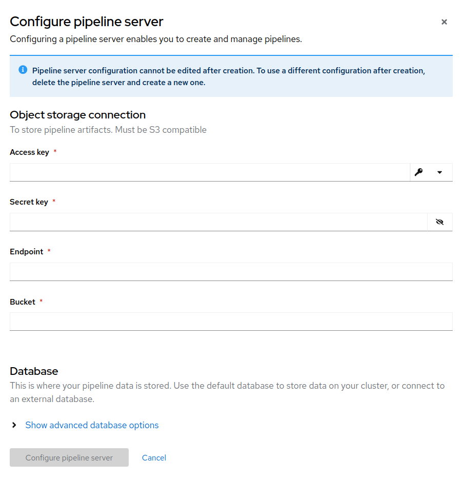

Alternatively, you can click the the key icon and populate the form with any Data Connection available in the project:


Once this is complete, the UI will not show any pipelines. However, the `Import Pipeline` button will now be available where it was greyed out before:


At this point the cluster will have created 4 deployments in your Data Science Project

```
ds-pipeline-persistenceagent-pipelines-definition
ds-pipeline-pipelines-definition                 
ds-pipeline-scheduledworkflow-pipelines-definition
mariadb-pipelines-definition  
```

OpenShift AI is now ready to handle AI pipelines.
