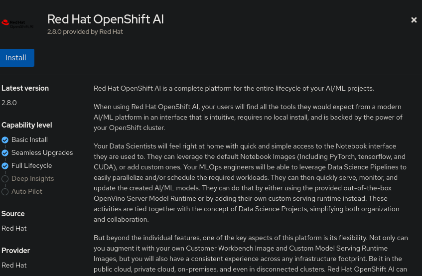
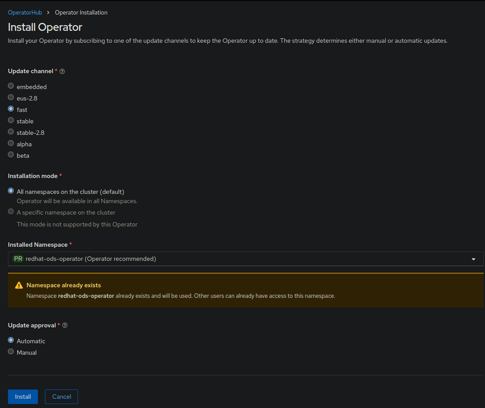
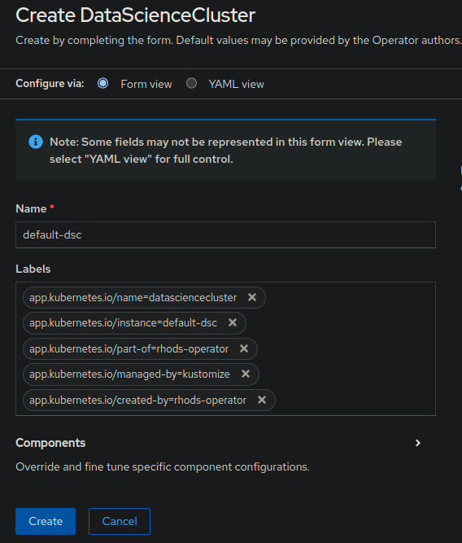

The OpenShift AI Operator has two objects to create before it is fully operational in the cluster:

1. The Operator Subscription
2. The Data Science Cluster

Navigate to **Operators --> OperatorHub** on the left hand menu in the OpenShift UI and search for OpenShift AI and select the appropriate option:

The next screen is purely informational, explaining a bit about the operator itself. There are no options on this page, so after you are done reading you can click the **Install** button:

The following page helps configure the behaviour of the operator. Choose the correct channel for your usecase. If OpenShift AI already has all the features you currently need, you might opt to select **stable**. However, OpenShift AI is a fast moving project and if you want to test features as soon as Red Hat deems them fit for use, select the **fast** channel.

The defaults on this page are suitable for the majority of cases.

After the OpenShift AI Operator has completed installation you will need to create a DataScienceCluster. You will likely be prompted to do so with the following screen (if you have not browsed away during the Operator installation):

The DataScienceCluster controls various components such as CloudFlare, KServe, Workbenches and other related objects. In most cases, excepting the defaults is sufficient. 

