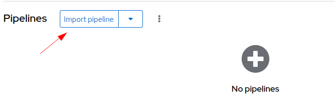

## Creating A Pipeline Server
Before you can successfully create a pipeline in OpenShift AI, you must configure a pipeline server. This process is very straight forward. You need to have 
1. A Workbench
2. Cluster storage for the workbench
3. A Data Connection

### UI - Pipeline Server

In The OpenShift AI UI, navigate to `Data Science Projects --> <your project>`. 


Once you have selected the desired project, you will see the requisite objects (Workbenches, Cluster Storage, Data Conenctions etc)


Select `Configure Pipeline Server`. You will be greated with the option of inputting your Data Connection details.


Alternatively, you can click the the key icon and populate the form with any Data Connection available in the project:


Once this is complete, the UI will not show any pipelines. However, the `Import Pipeline` button will now be available where it was greyed out before:



At this point the cluster will have created 4 deployments in your Data Science Project

```
ds-pipeline-persistenceagent-pipelines-definition
ds-pipeline-pipelines-definition                 
ds-pipeline-scheduledworkflow-pipelines-definition
mariadb-pipelines-definition  
```

OpenShift AI is now ready to handle AI pipelines.

## CLI - Pipeline Server

In order to create a Pipeline server via the CLI a new object called `DataSciencePipelinesApplication` needs to be created in the Data Science Project. This file requires some adjusting for your specific environment.

```
apiVersion: datasciencepipelinesapplications.opendatahub.io/v1alpha1
kind: DataSciencePipelinesApplication
metadata:
  name: pipelines-definition
spec:
  apiServer:
    applyTektonCustomResource: true
    archiveLogs: false
    autoUpdatePipelineDefaultVersion: true
    collectMetrics: true
    dbConfigConMaxLifetimeSec: 120
    deploy: true
    enableOauth: true
    enableSamplePipeline: false
    injectDefaultScript: true
    stripEOF: true
    terminateStatus: Cancelled
    trackArtifacts: true
  database:
    disableHealthCheck: false
    mariaDB:
      deploy: true
      pipelineDBName: mlpipeline
      pvcSize: <CHANGE_ME>
      username: mlpipeline
  mlmd:
    deploy: false
  objectStorage:
    disableHealthCheck: false
    externalStorage:
      bucket: <CHANGE_ME>
      host: <CHANGE_ME>
      port: ""
      s3CredentialsSecret:
        accessKey: AWS_ACCESS_KEY_ID
        secretKey: AWS_SECRET_ACCESS_KEY
        secretName: <CHANGE_ME>
      scheme: http
  persistenceAgent:
    deploy: true
    numWorkers: 2
  scheduledWorkflow:
    cronScheduleTimezone: UTC
    deploy: true
```

In the above file the `pvcSize` by default is set to 10Gi, though this can be changed by altering this value. In addition, the Pipeline Server expects to have access to S3 compatible Object Storage. In the above example, the `secretName` is based on the Data Connection created earlier. OpenShift will prefix the name of the secret with the type of connection. In this case, the name of the storage is `dev-storage` so the secret is called `aws-connection-dev-storage`. Thus you would put `secretName: aws-connection-dev-storage` in the above YAML.

Once the above object is created in the project, you can check the status by running `oc describe dspa`. After a few minutes, the pods will have finished deploying and the cluster is ready to import Pipelines.

