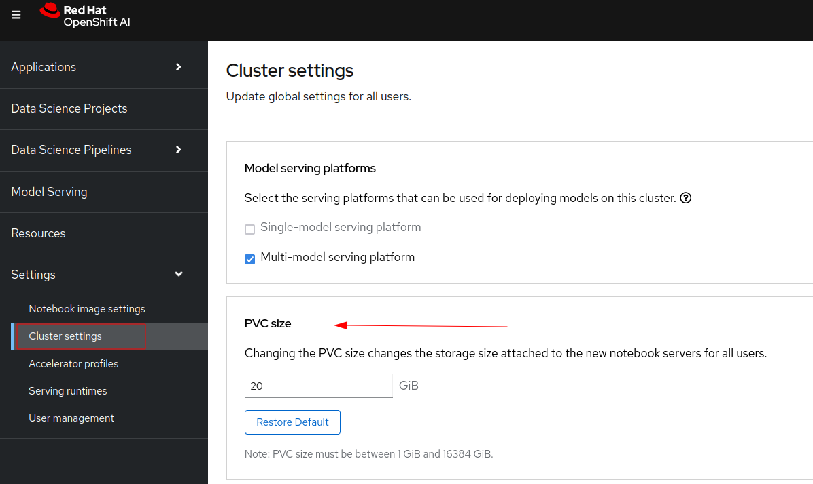

## Setting PVCs For Jupyter Notebooks

It is often desirable to adjust the default amount of storage provided to a Jupyter Notebook in order to accommodate the standard workloads your organization may wish to deploy. By default OpenShift AI will allocate 20G with of disk space to every Jupyter Notebook that is created.

### UI - Storage For Notebooks
In the OpenShift AI UI you can adjust the PVC settings by navigating to Settings --> Cluster Settings --> PVC Size



Update the PVC to the desired size, scroll all the way to the bottom and click Save.

> ![IMPORTANT]
> This change causes several pods to restart and may cause disruption to active processes. This should only be done when disruption can be tolerated.

### CLI - Storage For Notebooks

In the `redhat-ods-applications` project the `odhdashboardconfig` contains some of the default options for the `notebookController`. Specifically:

```
    notebookController:
      enabled: true
      notebookNamespace: rhods-notebooks
      notebookTolerationSettings:
        enabled: false
        key: NotebooksOnly
      pvcSize: 5Gi
```

You can edit this with an `oc patch` command similar to the following

```
oc patch odhdashboardconfig/odh-dashboard-config -p '{"spec":{"notebookController": {"pvcSize":"6Gi"}}}' --type merge
```

Alternatively you can create a file with contents similar to this:

```
apiVersion: opendatahub.io/v1alpha
kind: OdhDashboardConfig
metadata:
  name: odh-dashboard-config
  namespace: redhat-ods-applications
spec:
  notebookController:
    pvcSize: "5Gi"
```

and then use `oc apply -f <myfile>.yaml` to apply the changes
