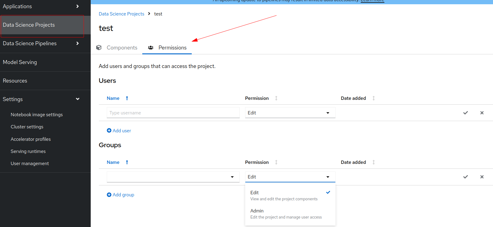

## General Explanation
OpenShift AI relies on most of the underlying mechanisms in OpenShift for controlling access to OpenShift AI. In vanilla OpenShift, you create projects which then have various security methods applied to them in order to ensure that administrators have fine-grained control over who can access which objects and with what permissions. A Data Science Project is just an OpenShift Project that has a specific label which enables it to be used with the OpenShift AI Dashboard. 

## Enabling A Specific Project

Specifically, the label `opendatahub.io/dashboard=true` allows the project to be interacted with from the OpenShift AI Dashboard.

The below sample command will label `some-proj` for use with the Dashboard.

```
oc label namespace some-proj opendatahub.io/dashboard=true
```

Optionally, you can also add `modelmesh-enabled='true'` where applicable to further enhance a project.

## Creating Data Science Projects

Because Data Science Projects are simply OpenShift Projects with an extra label or two, the same rules apply. Namely, by default the `self-provisioner` is assigned to the `system:authenticated` group. This means that in the default configuration, anyone who can log in to OpenShift, can create a Data Science Project. In addition, the user that creates the project will automatically become the project administrator. 

### Prevent Data Science Project Creation

In order to prevent users from creating their own Data Science Project, you will need to patch the clusterrolebinding:
```
oc patch clusterrolebinding.rbac self-provisioners -p '{"subjects": null}'
```
> [!WARNING]
> This will disable all users from creating all projects in the OpenShift cluster where OpenShift AI is running

## Users And Groups 

### Using OpenShift AI's Dashboard

OpenShift AI's Dashboard is an object inside of OpenShift. By default the Dashboard will have the option to "Log in with OpenShift"


This means if you have an authentication provider configured by an OpenShift Administrator, those users and groups will be available within the OpenShift AI Dashboard. There is a distinction between users who are allowed to login to the OpenShift AI Dashboard and users who have access to various Data Science Projects.

#### UI - Controlling Access To The Dashboard Itself

There are two methods for manipulating group access. First, the OpenShift AI Dashboard (assuming the user you are logged in as has the appropriate permissions) allows administrators to select via a drop down groups:

.

> [!IMPORTANT]
> By default the `system:authenticated` group is selected. This allows anyone who can log into OpenShift to have access to the OpenShift AI Dashboard. This may not be what you want.

When you make a change to the user or group, the Dashboard Config object is edited for you. The operator, which resides in the project `redhat-ods-operator` will reconcile the changes made to this object after a short period of time by merging the changes with the active configuration of the containers.

#### UI - Controlling Data Science Project Access

You may wish to grant users or groups to various roles inside of a Data Science Project as well. In order to do this, select Data Science Projects --> Your Project  --> Permissions:



From here you can select the various roles you might have created in your OpenShift Cluster. By default the Edit and Admin options are available.

### Using The CLI

#### CLI - Controlling Access To The Dashboard Itself
Access to the Dashboard can be controlled by editing the `odh-dashboard-config` which resides in the `redhat-ods-applications` project. 

You will see the following:

```
apiVersion: opendatahub.io/v1alpha
kind: OdhDashboardConfig
metadata:
  [...]
  name: odh-dashboard-config
  namespace: redhat-ods-applications
spec:
  dashboardConfig:
    [...]
  groupsConfig:
    adminGroups: rhods-admins
    allowedGroups: system:authenticated
```

Editing the `groupsConfig` will cause the operator to reconcile and update the Dashboard pods. It is also possible to create a YAML file that changes just the `groupsConfig` with the following contents:

```
apiVersion: opendatahub.io/v1alpha
kind: OdhDashboardConfig
metadata:
  name: odh-dashboard-config
  namespace: redhat-ods-applications
spec:
  groupsConfig:
    allowedGroups: "system:authenticated"
```

You can then apply the changes by using `oc apply -f <myfile>.yaml`

> [!IMPORTANT]
> If you want to specify a list of groups, they need to be comma separated:
> ```
> spec:
>  groupsConfig:
>    allowedGroups: "system:authenticated,rhods-users"
> ```

Alternatively you can use a command similar to the following to patch in your changes:
```
oc patch odhdashboardconfig/odh-dashboard-config -p '{"spec":{"groupsConfig": {"allowedGroups":"rhods-users"}}}' --type merge
```

You can follow the same process for editing the `adminGroups` instead of the `allowedGroups`. This group specifies which group of users will have admin access to the OpenShift AI Dashboard

#### CLI - Controlling Data Science Project Access

The process of granting access to a Data Science Project is the same as a regular OpenShift project. In general there are `view`, `edit` and `admin` roles. You would simply issue the following command:

```
oc adm policy add-role-to-group <role> <group name> -n <data science project name>
```
